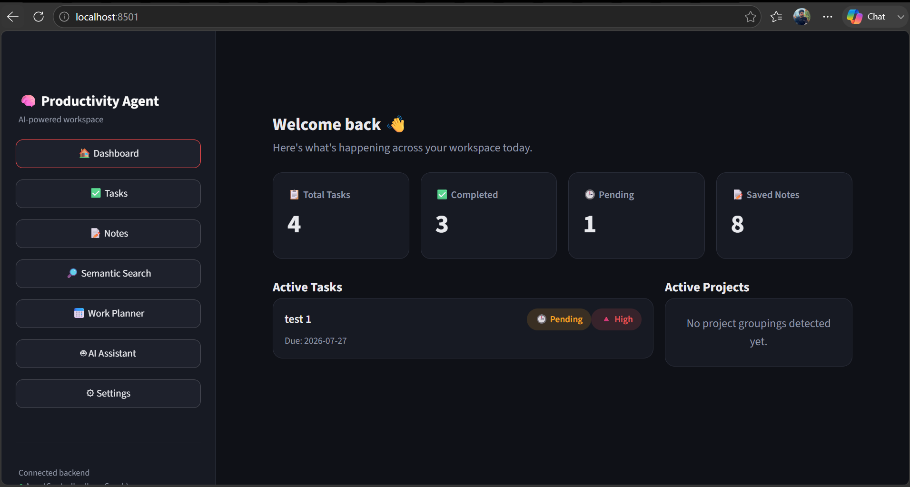
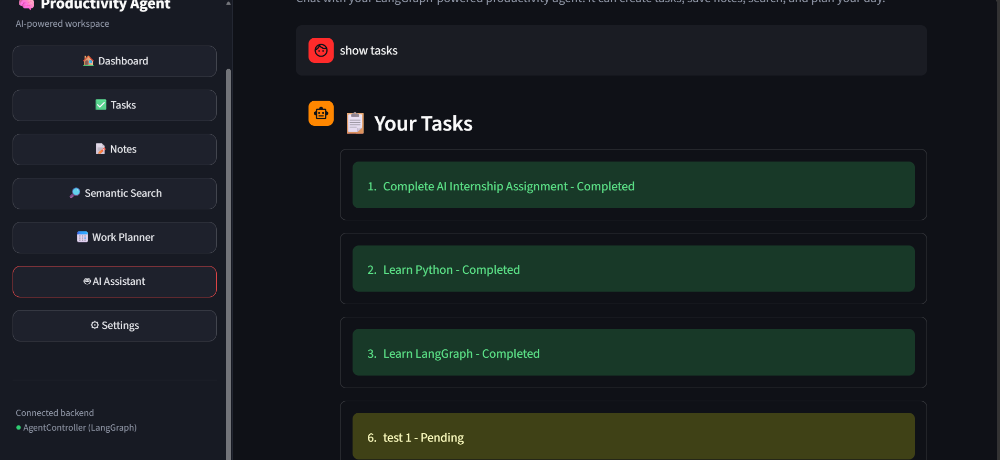
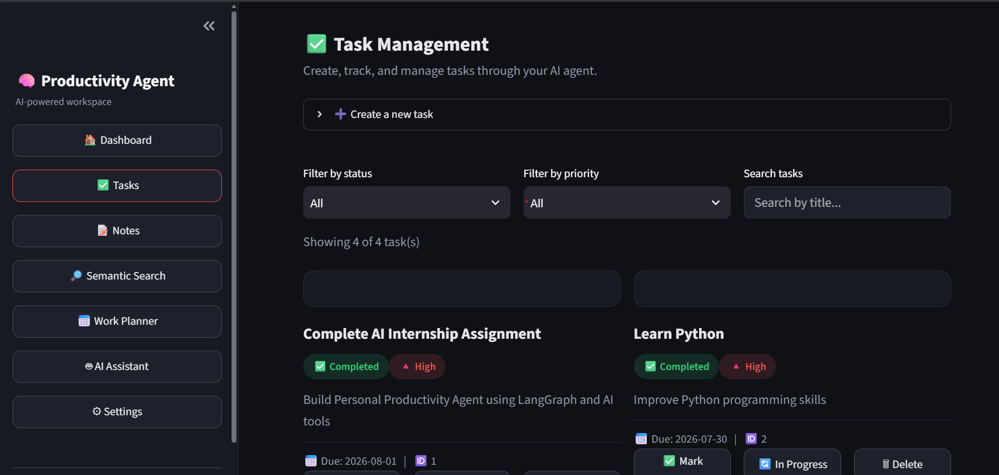
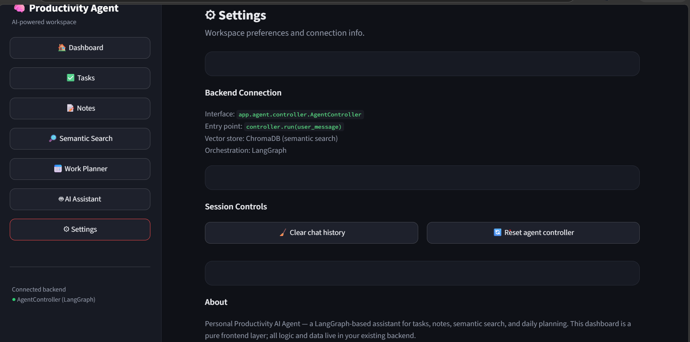

# Personal Productivity AI Agent

<p align="center">


</p>

An intelligent AI-powered productivity assistant built using **LLM Agents, LangGraph, Tool Calling, Vector Search, and Persistent Memory**.

This project demonstrates how modern AI Agents understand user requests, make decisions, select tools, execute actions, and maintain context.

---

# Project Overview

The Personal Productivity AI Agent is an AI-based assistant that helps users manage tasks, notes, and productivity workflows through natural language interaction.

Unlike traditional chatbots, this agent can:

- Understand user intent
- Decide required actions
- Select appropriate tools
- Execute tasks automatically
- Store and retrieve information
- Perform semantic search
- Maintain memory

Developed as part of the **AI Engineering Fellowship 2026 - NLP & AI Agents Track**.

---

# Key Features

✅ AI Agent with decision making  
✅ Task management system  
✅ Notes management system  
✅ Semantic search using embeddings  
✅ ChromaDB vector database  
✅ LangGraph workflow orchestration  
✅ Tool-based architecture  
✅ Persistent memory  
✅ Error handling  
✅ Productivity planning  

---

# Technology Stack

## Programming Language

- Python

## AI Frameworks

- LangGraph
- LangChain
- OpenAI-compatible LLM API

## Memory & Search

- ChromaDB
- Sentence Transformers
- Semantic Search

## Development Tools

- Visual Studio Code
- Git & GitHub
- Python Virtual Environment

---

# System Architecture

```
User Input
    |
    ↓
AI Agent (LLM Decision Maker)
    |
    ↓
LangGraph Controller
    |
    ↓
Tool Selection
    |
    ↓
Tool Execution
    |
    ↓
Memory Update
    |
    ↓
Final Response
```

---

# Available Agent Tools

The AI Agent uses tools according to user requests.

## Task Management

| Tool | Description |
|---|---|
| Create Task | Creates new tasks |
| List Tasks | Shows saved tasks |
| Update Task | Updates task details |
| Complete Task | Marks tasks completed |

## Note Management

| Tool | Description |
|---|---|
| Save Note | Stores important information |
| Search Notes | Semantic search using embeddings |
| Extract Meeting Actions | Converts discussions into actions |

## Planning

| Tool | Description |
|---|---|
| Generate Work Plan | Creates structured productivity plans |

---

# How The AI Agent Works

```
User Request
    |
    ↓
Intent Understanding
    |
    ↓
LLM Decision Making
    |
    ↓
Tool Selection
    |
    ↓
Tool Execution
    |
    ↓
Response Generation
```

The agent:

1. Receives user input
2. Understands user intention
3. Chooses the correct tool
4. Executes the required action
5. Updates memory
6. Returns the final response

---

# Application Screenshots

## Dashboard



---

## AI Agent



---

## Task Management



---

## Notes Management


---

## Semantic Search


---

## Work Planner


---

## Settings



---

# Project Structure

```
Week 3 Personal-Productivity-Agent

├── app/
│
├── screenshots/
│   ├── dashboard.png
│   ├── ai-agent.png
│   ├── Task-Manager.png
│   ├── creating notes.png
│   ├── semantic search.png
│   ├── work planner.png
│   └── settings.png
│
├── chroma_storage/
│
├── tasks.json
├── notes.json
├── requirements.txt
├── .env
└── README.md
```

---

# Installation & Setup

## Clone Repository

```bash
git clone https://github.com/your-username/Week-3-Personal-Productivity-Agent.git
```

## Enter Project Directory

```bash
cd Week-3-Personal-Productivity-Agent
```

## Create Virtual Environment

```bash
python -m venv .venv
```

## Activate Environment

Windows:

```bash
.venv\Scripts\activate
```

## Install Dependencies

```bash
pip install -r requirements.txt
```

## Run Application

```bash
python -m streamlit run app/main.py
```

---

# Evaluation & Testing

The project was tested for:

| Feature | Status |
|---|---|
| Create Task | ✅ Completed |
| List Tasks | ✅ Completed |
| Update Tasks | ✅ Completed |
| Complete Tasks | ✅ Completed |
| Save Notes | ✅ Completed |
| Semantic Search | ✅ Completed |
| Work Planner | ✅ Completed |
| Agent Decision Logic | ✅ Completed |

---

# Future Improvements

- Multi-agent collaboration
- User authentication
- Advanced long-term memory
- Mobile application
- Improved security
- Better reasoning capabilities

---

# Learning Outcomes

Through this project I gained practical experience in:

- AI Agent development
- LangGraph workflows
- Tool calling architecture
- Vector databases
- Embeddings
- Semantic search
- AI application design

---

# Author

**Hassan Murtaza Zaidi**

AI Engineering Intern | AI Automation Enthusiast

GitHub:  
https://github.com/hassanzaidi6575

LinkedIn:  
https://www.linkedin.com/in/hassan-murtaza-zaidi-403534416

---

# License

This project is developed for educational purposes.